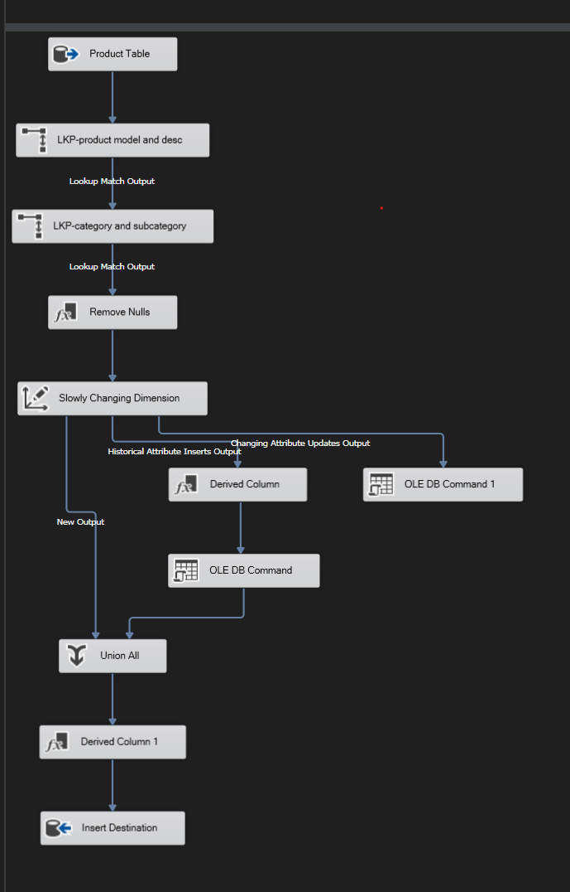
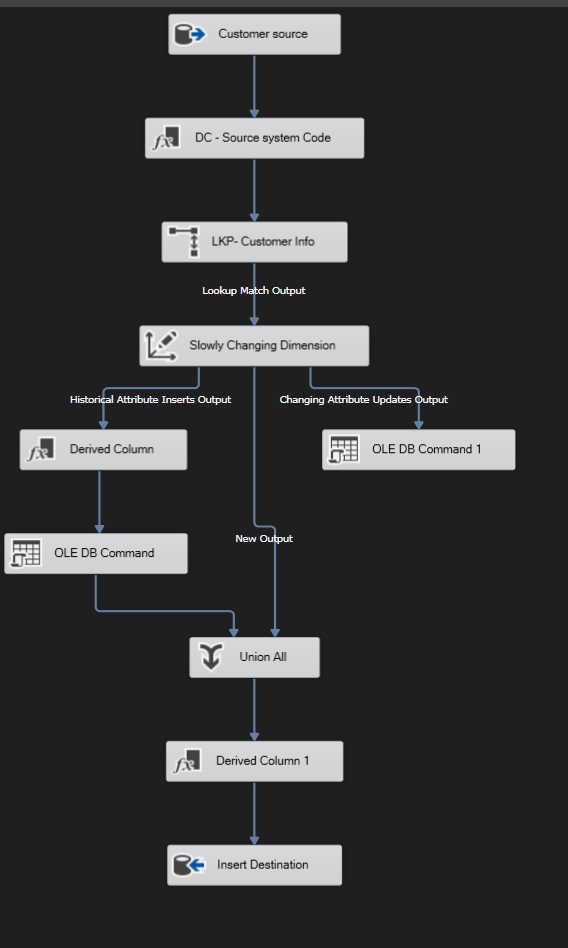
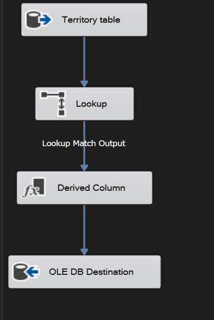
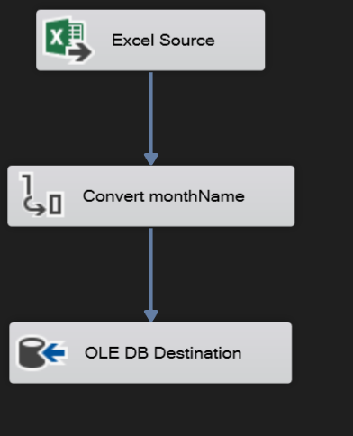
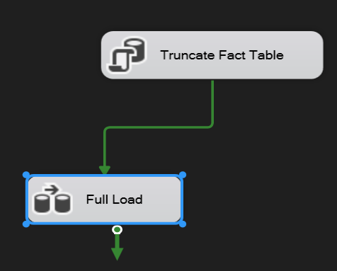
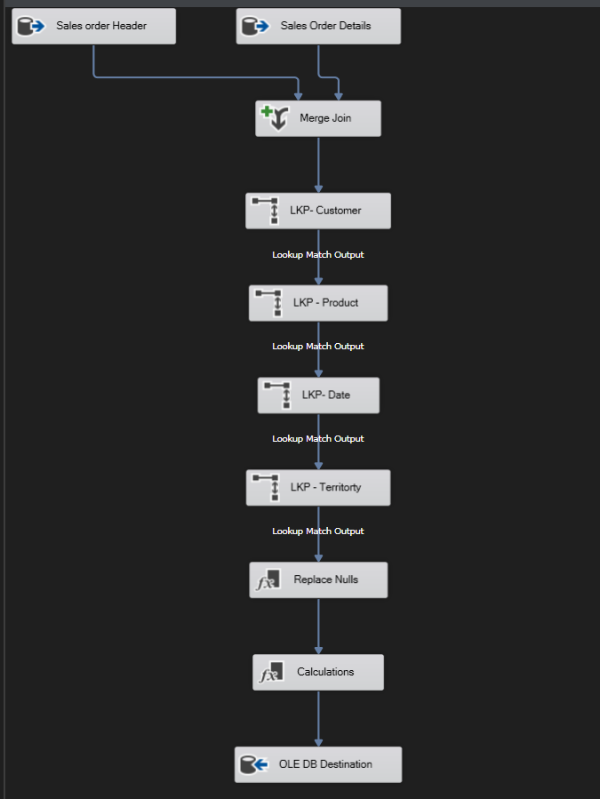
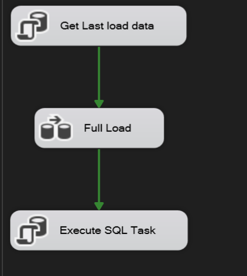
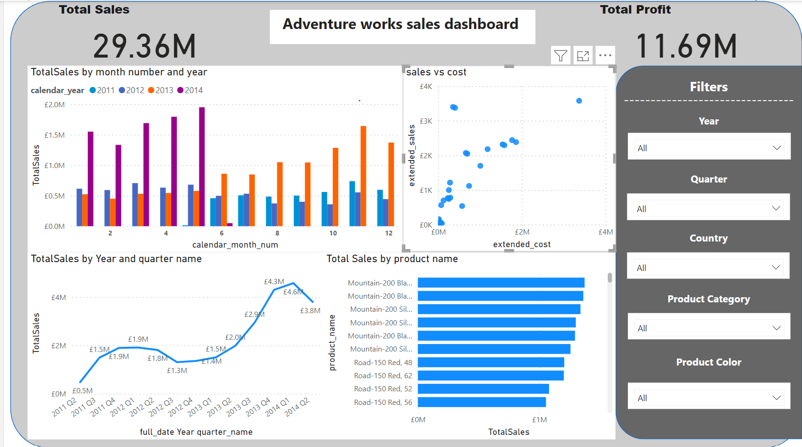

# Sales Data Mart (Adventure Works)
- [Introduction](#Introduction)
- [Technologies](#Technologies)
- [Designing DWH](#Designing_DWH)
- [SSIS](#SSIS)
- [Dashboard](#Dashboard)
- [Insights](#Insights)
***

## Introduction

Imagine a treasure trove of sales information, meticulously organized and ready for analysis. That's what you get with the Sales Data Mart built from your [AdventureWorks2022](https://learn.microsoft.com/en-us/sql/samples/adventureworks-install-configure?view=sql-server-ver16&tabs=ssms) data. SQL Server takes care of the heavy lifting, using SSIS to gather and organize the data, and then lets you explore it for valuable insights. This Data Mart is a great foundation for our OLTP to serve by making an interactive dashboard of this driven data to analyze our sales.

## Technologies
- Visual Studio
- SQL Server Integration Services (SSIS)
- SQL Server Management Studio (SSMS)
- Slowly changing dimension SCD (Type 1 and Type 2)
- Power BI

## Designing_DWH 

Star schema design offers a robust data organization approach for data warehouses. This multi-dimensional model separates factual data (measures) in a central fact table from descriptive attributes (dimensions) in surrounding tables. This structure facilitates efficient querying and analysis by enabling users to slice and dice data along various dimensions, providing deeper insights into business performance.

1 Fact table: **Fact sales**

4 dimension tables: 

    - Date
    - Customer
    - Product
    - Territory
- using these [scripts](./SQL%20Statments/)

</img> 

adding the attributes is_current, start_date and end_date to manage SCD

## SSIS

SSIS acts as the data pipeline in your data warehouse. It automates the movement and transformation of your data, like a tireless worker behind the scenes, ensuring your Sales Data Mart stays filled with the freshest information.
I used it to flow the data from the original database to the DWH using ETL proccess

6 Packages to build the data mart flow
- ETL_Dim_Product
- ETL_Dim_Customer
- ETL_Dim_Territory
- ETL_Dim_Date
- Fact_Sales_Full_Load 1
- Fact_Sales_Increamental_Load

### ETL DIM Product
</img> 

- Using lookups to relate the original data to our made tables in our data mart 
- Remove nulls by adding "Unkown" instead of missing attribues
- Using the slow changing dimension to manage type 1 and type 2 which will fetch the original data then any update happens in another route and union all of them changing the end data and is current attributes
- Change is current to 1 and start date to be current data before last step.

### ETL DIM Customer
</img>
- Using lookups to relate the original data to our made tables in our data mart 
- Adding the system code which I am currently working with
- Using the slow changing dimension to manage type 1 and type 2 which will fetch the original data then any update happens in another route and union all of them changing the end data and is current attributes
- Change is current to 1 and start date to be current data before last step.

### ETL DIM Territory
</img>
- Simple ETL proccess which will lock values only.
- adding is current, start date and system code

### ETL DIM Date
</img>
- Static process took data from excel date file
- change type of attributes to match our table types

### Fact Table full load
</img>

</img>

The main idea of this package is to full load the data from the database each time there is an update in the data fact table which will not be effecient way to handle 

### Fact Table Incremntal
</img>

The main differnce here is we use the same package of the full load and adding some modifications to make it work with updated data by adding a vraible in the SSIS called loaded data and add the new data to it and calling it from the package

All the packages sql code is in here [scripts](./SSIS%20SQL%20commands/)

## Dashboard

Using micrsoft Power BI to make an interactive dashboard to show the sales of the adventure work data mart we just loaded the data to it.

</img>

by adding filters from the all dimension tables and using it at all the dashboard page so we can manage our desired specfici insights to track any product

## Insights 

- The sales is increasing lineary
- 2014 months sales are much higher than any sales
- Road 150 costs more than the mountain 200
- Australia road is making more sales which is unusal
- Accessories sales started by 2013 it's making a huge profit and increasing every quarter
- Red Bikes sales are decreasing very much after got a big start in 2012 Q1